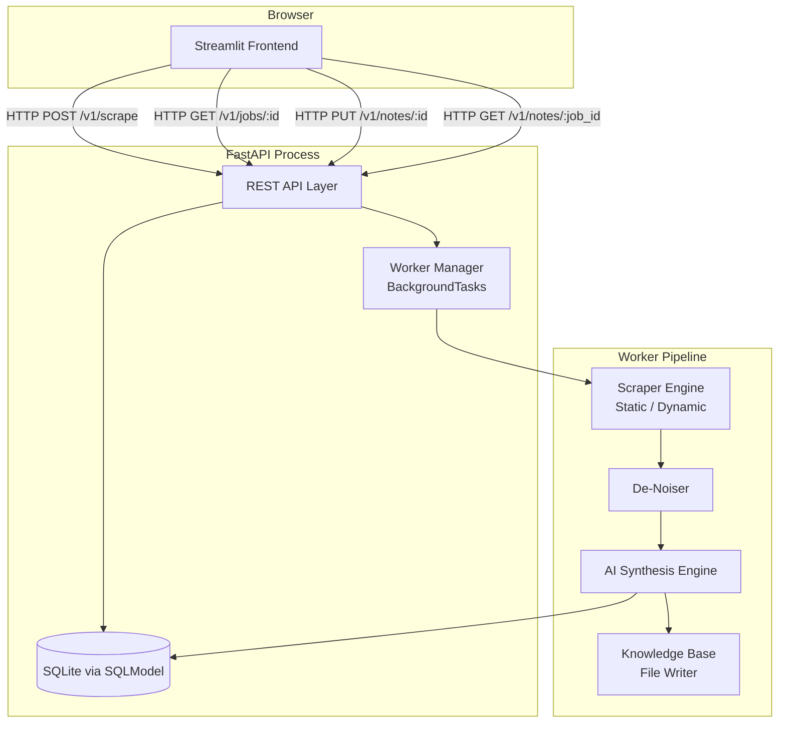
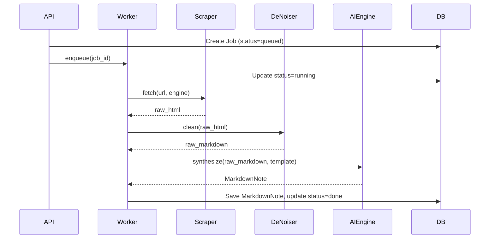

# Design Document: WebScribe

## Overview

WebScribe is a local research assistant that converts web pages into clean, structured Markdown notes. A user pastes a URL, selects a scraper mode and an AI template, and the system fetches the page, strips noise, and uses an LLM to produce a ready-to-use knowledge note. Notes are stored in SQLite and can be exported as `.md` files to a local knowledge base directory compatible with Obsidian, Notion, and GitHub wikis.

The system is composed of two processes:

- **FastAPI backend** — exposes a REST API, owns the database, and spawns background workers.
- **Streamlit frontend** — a single-page app with three views: Workspace, Library, and Templates.

Communication between the two is purely HTTP; the frontend polls the API for job status updates.

---

## Architecture



### Key Design Decisions

- **In-process background tasks** via FastAPI's `BackgroundTasks` (no external broker needed for the target scale of ≤5 concurrent jobs). This keeps the deployment to a single `uvicorn` process.
- **SQLite + SQLModel** for persistence — zero-config, file-based, and sufficient for a local tool.
- **Polling over WebSockets** — Streamlit's execution model makes WebSocket subscriptions awkward; 3-second polling is simple and meets the responsiveness requirement.
- **Playwright runs in a subprocess** to avoid blocking the async event loop.

---

## Components and Interfaces

### 1. REST API Layer (`api/`)

Thin FastAPI routers. Validates input, writes initial DB records, enqueues background tasks, and returns responses. No business logic lives here.

| Method | Path | Description |
|--------|------|-------------|
| `POST` | `/v1/scrape` | Submit one or more URLs for processing |
| `GET` | `/v1/jobs/{job_id}` | Get job status, logs, and timestamps |
| `PUT` | `/v1/notes/{note_id}` | Update a MarkdownNote's content or title |
| `GET` | `/v1/notes/{job_id}` | List all MarkdownNote versions for a job |
| `POST` | `/v1/notes/{note_id}/save` | Save a note to the Knowledge Base directory |
| `POST` | `/v1/jobs/{job_id}/rerun` | Re-run AI synthesis with a new template |

#### `POST /v1/scrape` — Request / Response

```json
// Request
{
  "urls": ["https://example.com/article"],
  "engine": "static",          // "static" | "dynamic"
  "template_id": "executive-summary"
}

// Response 200
{
  "jobs": [
    { "job_id": "uuid", "url": "https://example.com/article", "status": "queued" }
  ]
}

// Response 422 — malformed URL
{
  "detail": [{ "url": "not-a-url", "error": "Invalid URL scheme" }]
}
```

#### `GET /v1/jobs/{job_id}` — Response

```json
{
  "job_id": "uuid",
  "url": "https://example.com/article",
  "status": "running",          // queued | running | done | failed
  "engine": "static",
  "template_id": "executive-summary",
  "logs": ["Scraping...", "De-noising..."],
  "created_at": "2024-05-20T10:00:00Z",
  "updated_at": "2024-05-20T10:00:05Z"
}
```

#### `PUT /v1/notes/{note_id}` — Request / Response

```json
// Request
{ "title": "Updated Title", "content": "# Updated content..." }

// Response 200
{
  "id": "uuid",
  "job_id": "uuid",
  "title": "Updated Title",
  "content": "# Updated content...",
  "template_id": "executive-summary",
  "tags": ["Python", "API"],
  "version": 1,
  "saved_path": null,
  "created_at": "2024-05-20T10:00:10Z"
}
```

---

### 2. Worker Pipeline (`workers/`)

Executed by FastAPI's `BackgroundTasks`. Each job runs through four sequential stages, updating the job's `logs` list and `status` field after each stage.



---

### 3. Scraper Engine (`scrapers/`)

Two concrete implementations behind a common interface:

```python
class ScraperResult:
    raw_html: str
    final_url: str   # after redirects
    status_code: int

class BaseScraper(ABC):
    @abstractmethod
    async def fetch(self, url: str) -> ScraperResult: ...
```

**StaticScraper** — uses `httpx` for the HTTP request and returns the raw HTML body. Fast, no JS execution.

**DynamicScraper** — launches a Playwright browser in a subprocess, navigates to the URL, waits for `networkidle`, and returns `page.content()`. Enforces a 30-second timeout; raises `ScraperTimeoutError` on breach.

---

### 4. De-Noiser (`denoiser/`)

Pure function: `clean(raw_html: str) -> str` — returns Markdown.

Algorithm:
1. Parse HTML with BeautifulSoup (`lxml` parser).
2. Attempt to select `<main>` or `<article>` as the content root; fall back to `<body>`.
3. Decompose all `<header>`, `<footer>`, `<nav>`, `<aside>`, `<script>`, `<style>` tags.
4. Convert the remaining tree to Markdown using `markdownify`, preserving headings, lists, code blocks, and hyperlinks.
5. Strip leading/trailing whitespace and collapse runs of 3+ blank lines to 2.
6. Return the cleaned Markdown string.

Raises `InsufficientContentError` if the result is fewer than 50 characters.

---

### 5. AI Synthesis Engine (`ai_engine/`)

```python
async def synthesize(raw_markdown: str, template: Template) -> MarkdownNote: ...
```

- Builds a prompt by injecting `raw_markdown` into `template.prompt_template`.
- Calls the configured LLM (OpenAI-compatible API) with the assembled prompt.
- Parses the LLM response into a `MarkdownNote` (title, summary, key concepts, code snippets, action items, tags).
- Retries up to 3 times with exponential backoff (1s, 2s, 4s) on API errors.
- Raises `AIEngineError` after exhausting retries.

---

### 6. Knowledge Base File Writer (`kb/`)

```python
def save_to_kb(note: MarkdownNote, kb_dir: Path) -> Path: ...
```

- Derives filename: lowercase title, spaces and non-alphanumeric chars replaced with `-`, `.md` extension.
- If the file exists, appends `-2`, `-3`, etc. until a free name is found.
- Writes the note content atomically (write to `.tmp`, then rename).
- Returns the final `Path`.

---

### 7. Streamlit Frontend (`ui/`)

Three pages rendered via sidebar radio navigation:

| Page | Route key | Description |
|------|-----------|-------------|
| Workspace | `🔍 Workspace` | Submit URLs, monitor active job, edit the latest note |
| Library | `📚 Library` | Search and browse all notes, export `.md` |
| Templates | `⚙️ Templates` | View and edit AI prompt templates |

The frontend holds no business logic. All state is fetched from the API on each Streamlit rerun. Job status is polled every 3 seconds using `st.rerun()` with `time.sleep(3)` inside an active-job guard.

---

## Data Models

All models are defined with **SQLModel** (combines Pydantic validation + SQLAlchemy ORM).

### `Job`

```python
class JobStatus(str, Enum):
    queued  = "queued"
    running = "running"
    done    = "done"
    failed  = "failed"

class Job(SQLModel, table=True):
    id:          str        = Field(default_factory=lambda: str(uuid4()), primary_key=True)
    url:         str
    engine:      str        # "static" | "dynamic"
    template_id: str
    status:      JobStatus  = JobStatus.queued
    logs:        str        = "[]"   # JSON-encoded list[str]
    created_at:  datetime   = Field(default_factory=datetime.utcnow)
    updated_at:  datetime   = Field(default_factory=datetime.utcnow)
```

### `MarkdownNote`

```python
class MarkdownNote(SQLModel, table=True):
    id:          str      = Field(default_factory=lambda: str(uuid4()), primary_key=True)
    job_id:      str      = Field(foreign_key="job.id")
    title:       str
    content:     str      # Full Markdown body
    template_id: str
    tags:        str      = "[]"   # JSON-encoded list[str]
    version:     int      = 1
    saved_path:  str | None = None  # Absolute path if saved to KB
    created_at:  datetime = Field(default_factory=datetime.utcnow)
```

### `Template`

```python
class Template(SQLModel, table=True):
    id:              str  = Field(primary_key=True)   # e.g. "executive-summary"
    name:            str                               # Display name
    prompt_template: str                               # Jinja2 template string
    created_at:      datetime = Field(default_factory=datetime.utcnow)
    updated_at:      datetime = Field(default_factory=datetime.utcnow)
```

### `SourceLink` (view model, not persisted separately)

`SourceLink` is a read-only projection of a `Job` record used by the UI to display source metadata (URL, date scribed, engine used). It is not a separate database table.

### Filename Derivation Rules

Given a `MarkdownNote.title`, the filename is derived as:
1. Lowercase the entire string.
2. Replace any character that is not `[a-z0-9]` with a hyphen.
3. Collapse consecutive hyphens to a single hyphen.
4. Strip leading and trailing hyphens.
5. Append `.md`.

Example: `"FastAPI: A Deep Dive!"` → `fastapi-a-deep-dive.md`

---

## Correctness Properties

*A property is a characteristic or behavior that should hold true across all valid executions of a system — essentially, a formal statement about what the system should do. Properties serve as the bridge between human-readable specifications and machine-verifiable correctness guarantees.*

### Property 1: URL Validation Correctness

*For any* string submitted to the URL validator, the validator SHALL return `True` if and only if the string is a well-formed URL with an `http` or `https` scheme; and the API SHALL return a 422 response containing the offending URL for any string that fails validation.

**Validates: Requirements 1.2, 1.3**

---

### Property 2: Engine Routing

*For any* valid URL and engine selection (`"static"` or `"dynamic"`), the worker SHALL invoke exactly the corresponding scraper class and SHALL NOT invoke the other scraper class.

**Validates: Requirements 2.2, 2.3**

---

### Property 3: Dynamic Scraper Timeout Produces Failed Job

*For any* job dispatched with the `dynamic` engine where the scraper raises a `ScraperTimeoutError`, the final job status SHALL be `"failed"` and the job logs SHALL contain a message referencing the timeout.

**Validates: Requirements 2.6**

---

### Property 4: Content Extraction with Fallback

*For any* HTML document, the de-noiser SHALL extract content from the first `<main>` or `<article>` element when one is present; and when neither is present, it SHALL extract content from `<body>`. In both cases, the returned Markdown SHALL contain text that was present in the selected root element.

**Validates: Requirements 3.1, 3.2**

---

### Property 5: Noise Element Removal

*For any* HTML document containing `<header>`, `<footer>`, `<nav>`, `<aside>`, or `<script>` elements with known text content, the de-noiser output SHALL NOT contain that text content.

**Validates: Requirements 3.3**

---

### Property 6: Markdown Structure Preservation

*For any* HTML document containing headings (`<h1>`–`<h6>`), unordered/ordered lists, fenced code blocks, and hyperlinks, the de-noiser output SHALL contain the corresponding Markdown syntax (`#`, `-`/`1.`, ` ``` `, `[text](url)`) for each structural element present in the input.

**Validates: Requirements 3.4**

---

### Property 7: AI Engine Receives Content and Template

*For any* raw Markdown string and any `Template`, when `synthesize(raw_markdown, template)` is called, the LLM client SHALL be invoked with a prompt that contains both the raw Markdown content and the template's prompt string.

**Validates: Requirements 4.2**

---

### Property 8: MarkdownNote Has All Required Fields

*For any* valid LLM response, the `MarkdownNote` produced by the AI engine SHALL have non-empty `title`, `content`, `tags` fields, and SHALL have `key_concepts` and `summary` sections present in the content body.

**Validates: Requirements 4.3**

---

### Property 9: LLM Retry Count

*For any* AI synthesis call where the LLM client raises an error on every attempt, the LLM client SHALL be called exactly 3 times before the engine raises `AIEngineError`.

**Validates: Requirements 4.4**

---

### Property 10: Successful Synthesis Produces Done Job and Persisted Note

*For any* job that completes the full worker pipeline without error, the job's final status SHALL be `"done"` and a `MarkdownNote` record linked to that `job_id` SHALL be retrievable from the database.

**Validates: Requirements 4.5**

---

### Property 11: Job Status Response Contains Required Fields

*For any* existing job ID, `GET /v1/jobs/{job_id}` SHALL return a response containing `job_id`, `status`, `logs`, `created_at`, and `updated_at` fields.

**Validates: Requirements 5.1**

---

### Property 12: Status Transitions Are Immediately Reflected in DB

*For any* job undergoing a status transition (`queued → running`, `running → done`, `running → failed`), a `GET /v1/jobs/{job_id}` call made immediately after the transition SHALL return the new status.

**Validates: Requirements 5.2**

---

### Property 13: Failed Job Error Message Rendered in UI

*For any* failed job with an arbitrary error message in its logs, the UI workspace view SHALL render a string containing that error message.

**Validates: Requirements 5.4**

---

### Property 14: 404 for Non-Existent Job

*For any* UUID that does not correspond to an existing job in the database, `GET /v1/jobs/{job_id}` SHALL return HTTP 404.

**Validates: Requirements 5.5**

---

### Property 15: Note Edit Round-Trip

*For any* existing note ID and any Markdown content string, a `PUT /v1/notes/{id}` request with that content followed by `GET /v1/notes/{job_id}` SHALL return a note whose `content` field equals the submitted content.

**Validates: Requirements 6.3, 6.4**

---

### Property 16: 404 for Non-Existent Note on PUT

*For any* UUID that does not correspond to an existing note in the database, `PUT /v1/notes/{id}` SHALL return HTTP 404.

**Validates: Requirements 6.5**

---

### Property 17: Re-Run Does Not Re-Scrape

*For any* completed job and any template selection, triggering a re-run AI action SHALL NOT invoke the scraper and SHALL produce a new `MarkdownNote` record linked to the same `job_id`.

**Validates: Requirements 7.2**

---

### Property 18: Version Count Invariant

*For any* job, after triggering AI synthesis N times (initial run + N−1 re-runs), there SHALL be exactly N `MarkdownNote` records in the database linked to that `job_id`.

**Validates: Requirements 7.3**

---

### Property 19: Notes Ordered by Timestamp Descending

*For any* job with N associated `MarkdownNote` records having distinct `created_at` timestamps, `GET /v1/notes/{job_id}` SHALL return the notes in strictly descending order of `created_at`.

**Validates: Requirements 7.5, 10.3**

---

### Property 20: KB File Content Matches Note

*For any* `MarkdownNote` with arbitrary content, saving it to the Knowledge Base SHALL produce a file whose content is byte-for-byte equal to the note's `content` field.

**Validates: Requirements 8.2**

---

### Property 21: Filename Derivation Rules

*For any* note title string, the derived filename SHALL be lowercase, contain only the characters `[a-z0-9-]`, not start or end with a hyphen, and end with `.md`.

**Validates: Requirements 8.3**

---

### Property 22: Collision Avoidance Produces Distinct Filenames

*For any* sequence of N saves where all notes share the same title, the resulting N files SHALL all exist on disk simultaneously with distinct names following the pattern `<slug>.md`, `<slug>-2.md`, `<slug>-3.md`, …

**Validates: Requirements 8.4**

---

### Property 23: KB Save Updates DB Record

*For any* `MarkdownNote` saved to the Knowledge Base, the `MarkdownNote` record in the database SHALL have its `saved_path` field set to the absolute path of the written file.

**Validates: Requirements 10.4**

---

## Error Handling

| Error Condition | Component | Behavior |
|---|---|---|
| Malformed or non-http/https URL | API validation | Return 422 with per-URL error detail |
| Scraper HTTP error (4xx/5xx) | StaticScraper | Raise `ScraperError`; worker marks job `failed` |
| Dynamic scraper timeout (>30s) | DynamicScraper | Raise `ScraperTimeoutError`; worker marks job `failed` |
| Insufficient content (<50 chars) | De-Noiser | Raise `InsufficientContentError`; worker marks job `failed` |
| LLM API error (after 3 retries) | AI Engine | Raise `AIEngineError`; worker marks job `failed` |
| Non-existent job ID | API | Return 404 |
| Non-existent note ID | API | Return 404 |
| KB filename collision | KB Writer | Append numeric suffix; never overwrite |
| DB write failure | Worker | Log error; mark job `failed` |

All worker errors are caught at the top of the worker function, which sets `job.status = "failed"` and appends the exception message to `job.logs` before exiting. This ensures the job never gets stuck in `running` state.

---

## Testing Strategy

### Dual Testing Approach

Unit tests cover specific examples, edge cases, and error conditions. Property-based tests verify universal properties across all inputs. Both are necessary for comprehensive coverage.

### Property-Based Testing Library

Use **[Hypothesis](https://hypothesis.readthedocs.io/)** for Python property-based testing.

- Minimum **100 iterations** per property test (Hypothesis default `max_examples=100`).
- Each property test is tagged with a comment referencing the design property:
  ```python
  # Feature: webscribe, Property 1: URL validation correctness
  @given(st.text())
  @settings(max_examples=100)
  def test_url_validation_correctness(url_string): ...
  ```

### Unit Tests

Focus on:
- Specific scraper behavior with known HTML fixtures
- De-noiser output for concrete HTML inputs (e.g., a page with only a `<nav>` and no `<main>`)
- AI engine prompt construction with a known template
- API endpoint response shapes with seeded DB records
- KB filename derivation for known title strings (e.g., `"FastAPI: A Deep Dive!"` → `fastapi-a-deep-dive.md`)

Avoid writing unit tests that duplicate what property tests already cover across many inputs.

### Integration Tests

- Full pipeline smoke test: POST a URL with a mocked scraper and LLM → assert job reaches `done` and note is in DB.
- Concurrency smoke test: 5 simultaneous jobs → assert all status-check requests respond within 500ms.
- DB initialization: start API with no DB file → assert schema is created.

### Test File Layout

```
tests/
  unit/
    test_url_validation.py       # Properties 1
    test_scraper_routing.py      # Properties 2, 3
    test_denoiser.py             # Properties 4, 5, 6
    test_ai_engine.py            # Properties 7, 8, 9, 10
    test_kb_writer.py            # Properties 20, 21, 22, 23
  api/
    test_jobs_api.py             # Properties 11, 12, 14
    test_notes_api.py            # Properties 15, 16, 18, 19
    test_scrape_api.py           # Properties 1 (API layer)
  integration/
    test_pipeline.py             # End-to-end smoke tests
```
